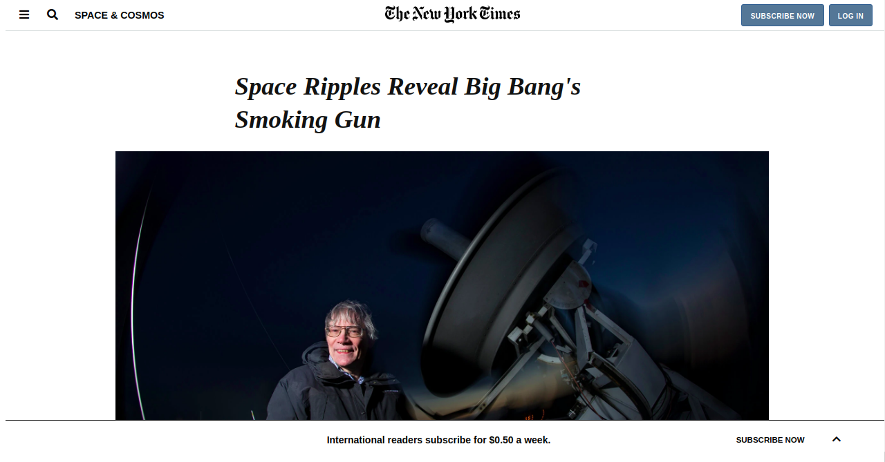
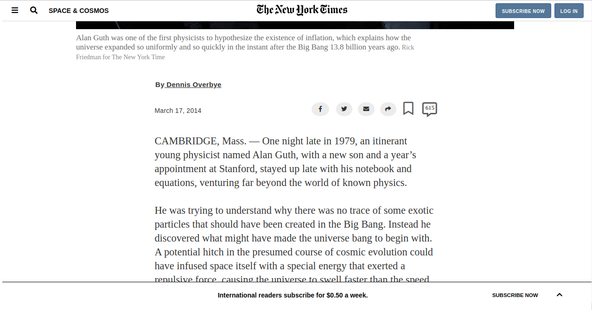
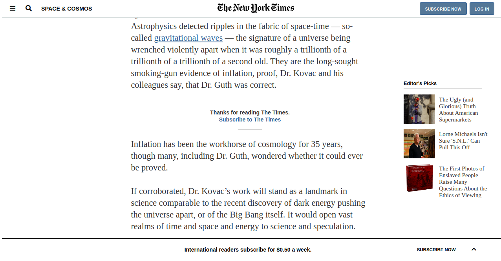
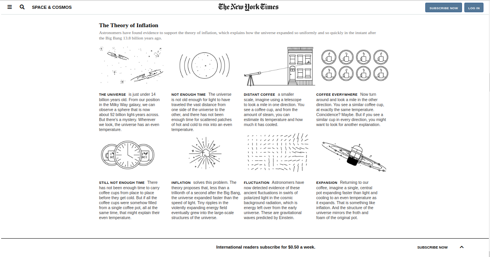

# NYT-clone-Project

*This are some images of this project:*

### **Description:** 

Project based on The New York Times site-article: "Space Ripples Reveal Big Bang’s Smoking Gun", contains different sections with embedded images and video, and an aside element on the right side.
 
 **Navbar (top) includes:**
 
 	- A menu icon.
 	- A search icon.
 	- A "space & cosmos" section with a linked URL.
 	- The New York Times logo with linked URL.
 	- A "subscribe now" button with a linked URL.
 	- A "log in"  button with linked URL.
 	
 **Main section**
 
  **Header:**
 
 	- Title of the article.
 	- Embedded image.
 	- Text under the image with special styling.
 	- Author and date information.
 	- Social icons (fb, twitter, email, share, mark and comments).
  
  **Article:**
  
 	- Main text-content of the article with center allignment.
 	- Aside section on the right side with embedded images and linked URLs.
 	- Section with a background image and text over it.
 	- An embedded Youtube video.
 	- A "read 615 comments" button.
 	- Section with suggested articles, which includes embbeded images and linked URLs.
 	- Section containing different categories and subcategories (news, opinion, arts, etc) that are available in The New York Times.
  
  **Footer:**
  
 	- Footer section.
 	- Bar fixed onto the bottom side that contains information about subscriptions.
 	
 	
 ### **Tools used:**
 
 HTML5, and CSS3.
 
 
 
  [Live demo link](https://milypm.github.io/NYT-clone-Project/)
 
 
 
 
### **Getting Started:**

The New York Times' article "Space Ripples Reveal Big Bang's Smoking Gun", includes: fixed Navbar, Main, Header, Article, Footer, and fixed bar at the bottom.

 ### **Requirements:** 
 - OS: Windows, Linux, or Mac.
 - Browser: Google Chrome, Mozilla Firefox, Edge, etc.
 

### **Set up:**

You can download the code or clone the repository to your local system.

## **Author:**

👤 Mily Puente

GitHub: [@milypm](https://github.com/milypm)

LinkedIn: [Mily Puente](https://www.linkedin.com/in/milypuentem/)

	
  
## **Show your support**

Spread the word if you like this project!

## **Acknowledgments**

Thanks to:
[W3Schools](http://w3schools-fa.ir)
[stack overflow](https://stackoverflow.com/)
[font awesome](https://fontawesome.com/)
